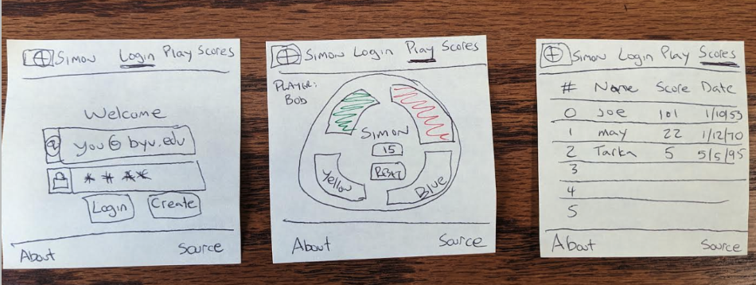

# Pie Vote App

[My Notes](notes.md)

The Pie Vote App lets users vote for their favorite pie flavor, see the results, and chat with other pie fans. It was designed to be a simple web application where users can interact in real time, see voting results, and view other users’ activity.

I am going to build a peer-to-peer multiplayer web application modeled after this. I will build it by adding new functionality every time I learn a new technology. The example version of code and production deployment for each iteration are available. I will review the example and then deploy it to my production environment. The goal is to think about every line of code. I will ask, "why is it done this way?" and "Is there a better way?" I can then take what I have learned, or even portions of the code, and apply it to my Startup application.

---

## 🚀 Specification Deliverable

The Pie Vote App is a simple application where users can vote on their favorite pie flavor. The results are shown in a table, placeholder charts are displayed, and there is a chat box for real-time interaction (placeholder). The app also has about and login pages with placeholders for authentication and third-party API content.

For this deliverable I did the following. I checked the box `[x]` and added a description for things I completed.

- [x] **Proper use of Markdown** – All sections formatted using headings, lists, and links. This README is written in Markdown and is hosted in the project root as `README.md`.
- [x] **A concise and compelling elevator pitch** – See the Elevator Pitch section below, included at the top of the README.
- [x] **Description of key features** – Listed under Key Features, with explanations of implementation.
- [x] **Description of how you will use each technology** – Listed under Technologies section, describing file location and usage.
- [x] **One or more rough sketches of your application** – Image embedded in Design section using Markdown: ``.

### Elevator Pitch

A mind is a beautiful thing, but it loves sweets. With the Pie Vote App, you can vote for your favorite pie flavor, see results in a table and chart placeholder, and chat with other pie fans in real time. Share your love for pie and see which flavors are most popular.

---

### Design

The design mock illustrates a simple layout: login page, voting page, scores page, and about page with placeholders.  

---

### Key Features

- **Login, logout, and register placeholders** – Implemented in `index.html` with a form containing email and password fields; buttons currently simulate login and account creation.
- **Vote for your favorite pie flavor** – Implemented in `play.html` using a form and buttons representing different pie flavors.
- **See results in a scores table** – Implemented in `scores.html` with a `<table>` element containing static sample vote data.
- **View placeholder pie chart** – Added in `scores.html` as a `<canvas>` element; chart library not yet connected.
- **Chat with other users (placeholder WebSocket)** – Added in `play.html` as a `<textarea>` to display messages; currently static until backend integration.
- **See a description of the app** – Included in `about.html` with text describing the Pie Vote App.
- **Read inspirational quote (placeholder for 3rd-party API)** – `about.html` includes a `
` placeholder for future API integration.

---

### Technologies

- **HTML** – Created separate files in the project root:  
  `index.html` (Login), `play.html` (Voting), `scores.html` (Scoreboard), `about.html` (About/Quote).  
  Each file contains structured HTML using `<header>`, `<footer>`, `<main>`, `<nav>`, `<form>`, `<table>`, and other semantic elements.
- **CSS / Bootstrap** – Added Bootstrap 5 CDN links in the `<head>` of each page. Used Bootstrap classes for layout, buttons, input groups, and navbar.
- **React** – Planned for later. Placeholder notes in `notes.md` for single-page application routing and state hooks.
- **Service** – Endpoints for authentication and vote storage noted in `notes.md`; currently placeholders in the HTML forms.
- **DB/Login** – Placeholder data shown in `scores.html` table; login simulation in `index.html`.
- **WebSocket** – Chat placeholder in `play.html` shows how messages would appear if WebSocket were connected.

---

## 🚀 AWS Deliverable

- [x] **Server deployed and accessible with custom domain name** – Deployed at [https://simon.260domain.click](https://simon.260domain.click).

---

## 🚀 HTML Deliverable

- [x] **HTML pages** – `index.html`, `play.html`, `scores.html`, `about.html` in project root.
- [x] **Proper HTML element usage** – Used `<header>`, `<footer>`, `<main>`, `<nav>`, ``, `<a>`, `<fieldset>`, `<input>`, `<button>`, `<form>`, `<table>` in their respective pages.
- [x] **Links** – Navigation links connect pages: Home → Vote → Scores → About.
- [x] **Text** – About page includes descriptive text about the app.
- [x] **3rd-party API placeholder** – `about.html` contains a `
` for a future inspirational quote.
- [x] **Images** – `about.html` displays a placeholder image (`designDiagram.png`).
- [x] **Login placeholder** – `index.html` form simulates login and account creation.
- [x] **DB data placeholder** – `scores.html` table shows sample voting results.
- [x] **WebSocket placeholder** – `play.html` contains a `<textarea>` to show chat messages for demonstration.

---
