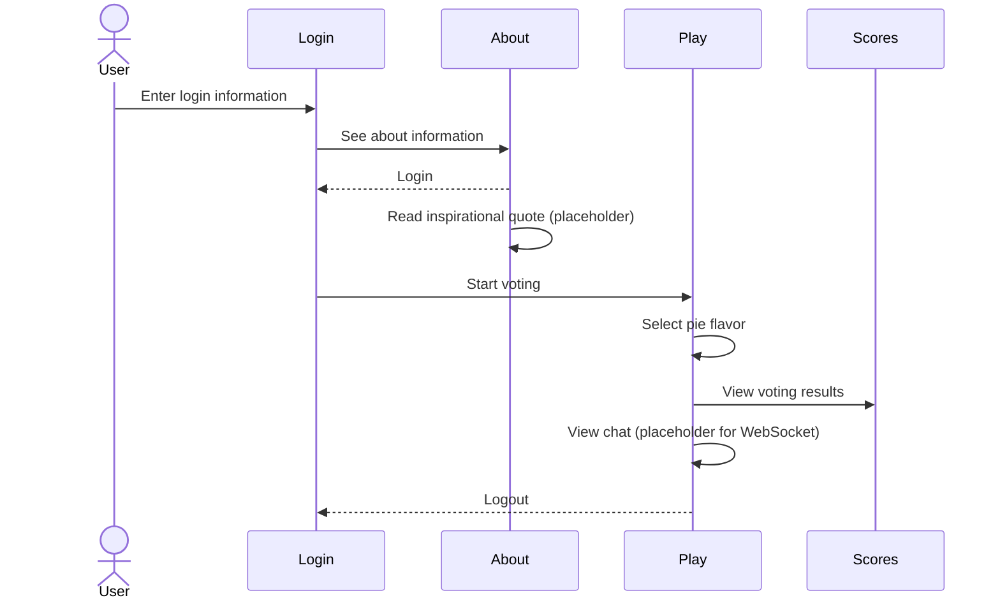

# Pie Vote App

[My Notes](notes.md)

The Pie Vote App lets users vote for their favorite pie flavor, see the results, and chat with other pie fans. It was designed to be a simple web application where users can interact in real time, see voting results, and view other users’ activity.

I am going to build a peer to peer multiplayer web application modeled after this. I will build it by adding new functionality every time I learn a new technology. The example version of code and production deployment for each iteration are available. I will review the example and then deploy it to my production environment. The goal is to think about every line of code. I  will ask, "why is it done this way?" and "Is there a better way?". I can then take what I have learned, or even portions of the code, and apply it to my Startup application.

## 🚀 Specification Deliverable

The Pie Vote App is a simple application where users can vote on their favorite pie flavor. The results are shown in a table, placeholder charts are displayed, and there is a chat box for real-time interaction (placeholder). The app also has about and login pages with placeholders for authentication and third-party API content.

For this deliverable I did the following. I checked the box `[x]` and added a description for things I completed.

- [x] Proper use of Markdown
- [x] A concise and compelling elevator pitch
- [x] Description of key features
- [x] Description of how you will use each technology
- [x] One or more rough sketches of your application. Images must be embedded in this file using Markdown image references.

### Elevator pitch

A mind is a beautiful thing, but it loves sweets. With the Pie Vote App, you can vote for your favorite pie flavor, see results in a table and chart placeholder, and chat with other pie fans in real time. Share your love for pie and see which flavors are most popular.

### Design

I will work on the design as I work on my project.

### Key features

- Login, logout, and register placeholders
- Vote for your favorite pie flavor
- See results in a scores table
- View placeholder pie chart
- Chat with other users (placeholder WebSocket)
- See a description of the app
- Read inspirational quote (placeholder for 3rd-party API)

### Technologies

I am going to use the required technologies in the following ways.

- **HTML** - Four different views, login/register controls, play, scoreboard, and about.
- **CSS** - Complementary color scheme, responsive design, button highlighting.
- **React** - Single page application with routing between views, reactive user controls, and state hooks (planned for later).
- **Service** - Endpoints for authentication, storing/retrieving votes. Third party call to get inspirational quotes (placeholder).
- **DB/Login** - Stores authentication and votes (placeholder).
- **WebSocket** - Broadcast user's voting/chat activity (placeholder).

## 🚀 AWS deliverable

For this deliverable I did the following. I checked the box `[x]` and added a description for things I completed.

- [x] **Server deployed and accessible with custom domain name** - [My server link](https://startup.260domain.click).

## 🚀 HTML deliverable

For this deliverable I did the following. I checked the box `[x]` and added a description for things I completed.

- [x] **HTML pages** - Four different pages. One for each view. index.html (Login), play.html, scores.html, and about.html.
- [x] **Proper HTML element usage** - I spent a lot of time learning about elements. I used header, footer, main, nav, img, a, fieldset, input, button, form, table, and many more.
- [x] **Links** - Links between views.
- [x] **Text** - About page has text.
- [x] **3rd party API placeholder** - About page has a place to display an inspirational quote.
- [x] **Images** - Image is displayed on the about page.
- [x] **Login placeholder** - Placeholder for auth on the login page.
- [x] **DB data placeholder** - Voting results displayed on scores page.
- [x] **WebSocket placeholder** - The play page has a text area that will show what other user messages would be.
